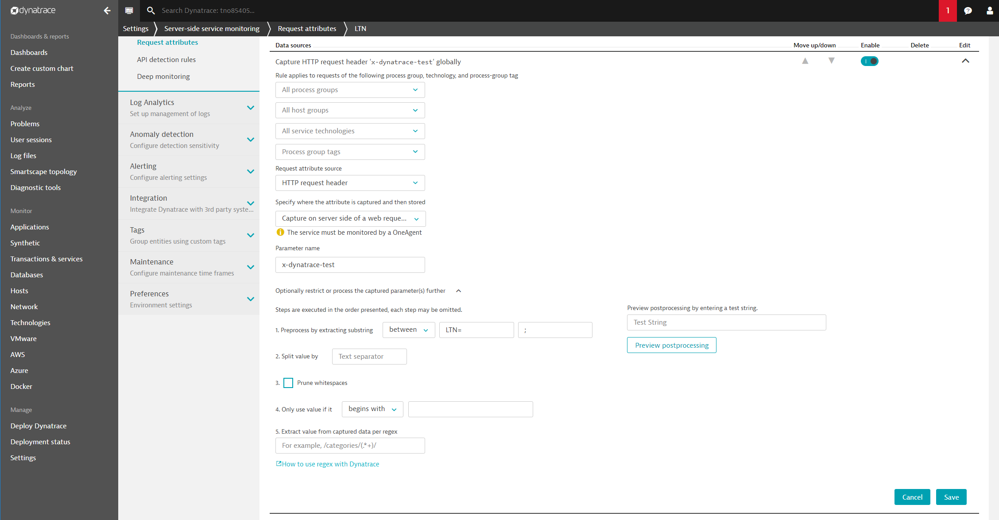
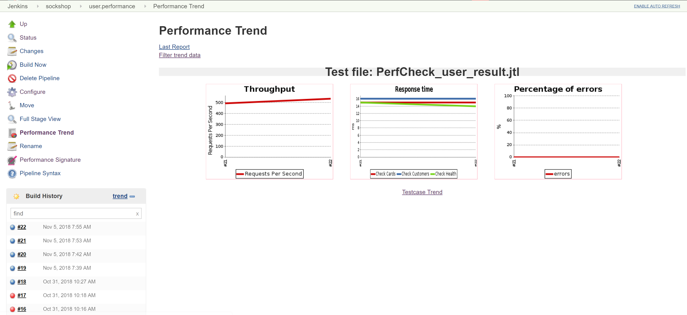
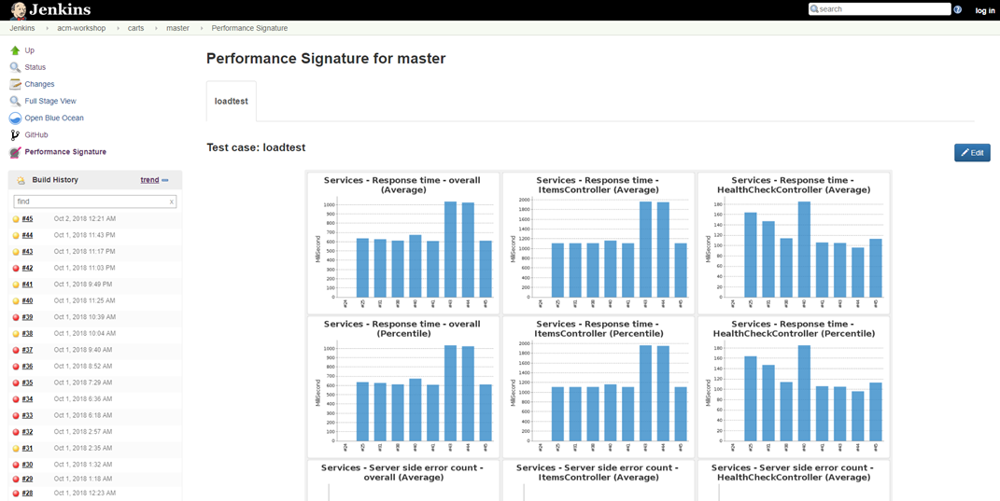
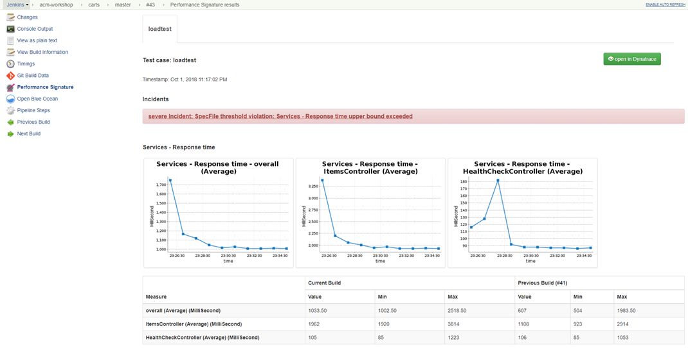
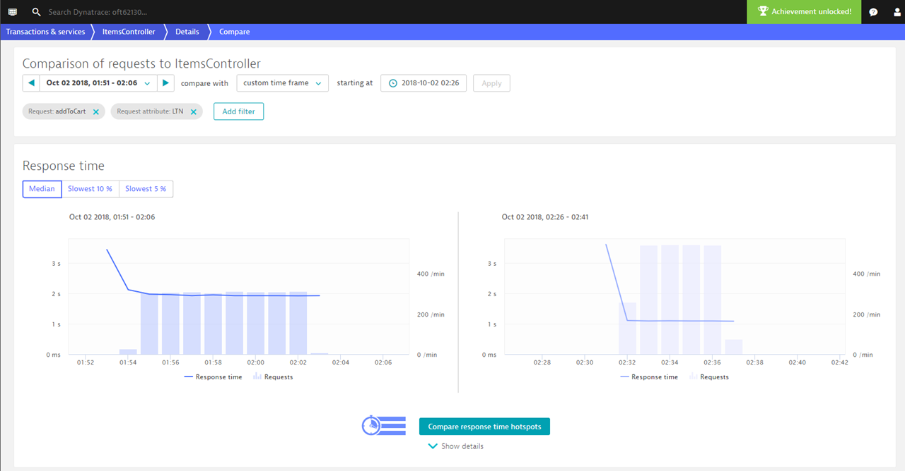
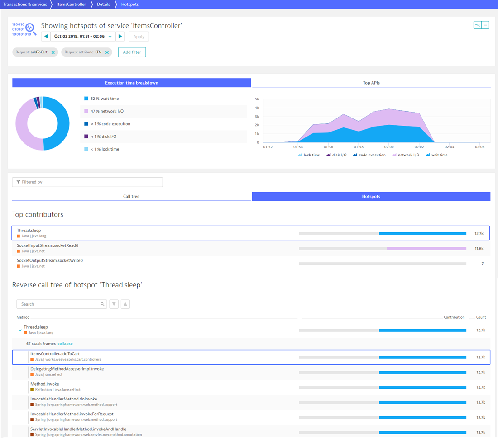

This use case shows how to setup a fully automated on-demand self-service model for performance testing.

## About this use case

The [Dynatrace Sockshop](https://github.com/dynatrace-sockshop) sample used in keptn v.0.1 consists of eight microservices that are under development. The goal of this use case is to provide an automated performance testing model for developers to run a performance test for these services on demand. This supports the implementation of an advanced DevOps approach due to early performance feedback regarding a service in a development environment and before it gets deployed into a production environment. All in all, this helps to move from manual sporadic execution and analysis of performance tests to a fully automated on-demand self-service model for developers.

To illustrate the scenario this use case addresses, you will change one service of Sockshop that gets deployed to the dev environment. Eager to understand the performance characteristics of this new deployment, you trigger a performance test. However, this performance test fails due to a quality gate in place. To investigate the issues resulting in this failed performance test, you will use a monitoring solution that allows a comparison of test load.




## Step 1: Define request attributes in Dynatrace

In this step you will set up a rule to capture request attributes in Dynatrace based on web request data. In more detail, the data stored in the request header `x-dynatrace-test` will be extracted to create request attributes that tag and distinguish service traffic. For further information on how to capture request attributes, [please see this page in the Dynatrace documentation.](https://www.dynatrace.com/support/help/monitor/transactions-and-services/request-attributes/how-do-i-capture-request-attributes-based-on-web-request-data/)

1. Create request attribute for Load Test Name (LTN)
    1. Go to **Settings**, **Server-side monitoring**, and click on **Request attributes**.
    1. Click the **Create new request attribute** button.
    1. Provide a unique *Request attribute name*: `LTN`
    1. Click on **Add new data source**.
    1. Select the *Request attribute source*: `HTTP request header`
    1. Specify the *Parameter name*: `x-dynatrace-test`
    1. Open *Optionally restrict or process the captured parameter(s) further*
    1. At *Preprocess by extracting substring* set: `between` > `LTN=` > `;`
    1. Finally, click **Save**, click **Save**.

    Screenshot shows this rule definition.
    

    

2. Create request attribute for Load Script Name (LSN)
    1. Go to **Settings**, **Server-side monitoring**, and click on **Request attributes**.
    1. Click the **Create new request attribute** button.
    1. Provide a unique *Request attribute name*: `LSN`
    1. Click on **Add new data source**.
    1. Select the *Request attribute source*: `HTTP request header`
    1. Specify the *Parameter name*: `x-dynatrace-test`
    1. Open *Optionally restrict or process the captured parameter(s) further*
    1. At *Preprocess by extracting substring* set: `between` > `LSN=` > `;`
    1. Finally, click **Save**, click **Save**.

3.  Create request attribute for Test Script Name (TSN)
    1. Go to **Settings**, **Server-side monitoring**, and click on **Request attributes**.
    1. Click the **Create new request attribute** button.
    1. Provide a unique *Request attribute name*: `TSN`
    1. Click on **Add new data source**.
    1. Select the *Request attribute source*: `HTTP request header`
    1. Specify the *Parameter name*: `x-dynatrace-test`
    1. Open *Optionally restrict or process the captured parameter(s) further*
    1. At *Preprocess by extracting substring* set: `between` > `TSN=` > `;`
    1. Finally, click **Save**, click **Save**.

## Step 2: Run performance test on carts service

In this step you trigger a performance test for (1) the current implementation of carts and (2) a new version of the carts service. The new version of carts intentionally contains a slow down of the service, which will be detected by the performance validation.

1. Run performance test on current implementation
    1. Go to  **Jenkins** and click on **sockshop** folder.
    1. Click on **carts.performance** and click on **Scan Multibranch Pipeline Now**.
    1. Then select the **master** branch and click on **Build Now** to trigger the performance pipeline.

1. Introduce a slowdown in the carts service
    1. In the directory of `~/keptn/repositories/carts/`, open the file: `./src/main/resources/application.properties`
    1. Change the value of `delayInMillis` from `0` to `1000`
    1. Commit/Push the changes to your GitHub Repository *carts*

    ```console
    $ git add .
    $ git commit -m "Property changed"
    $ git push
    ```

1. Build this new version
    1. Go to your **Jenkins** and click on **sockshop** folder.
    1. Click on **carts** and select the **master** branch (or click on **Scan Multibranch Pipeline Now**).
    1. Click on **Build Now** to trigger the performance pipeline.
    1. Wait until the pipeline shows: *Success*.

1. Run performance test on new version
    1. Go to **Jenkins** and click on **sockshop** folder.
    1. Click on **carts.performance** and select the **master** branch.
    1. Click on **Build Now** to trigger the performance pipeline.

1. Explore results in Jenkins
    1. After a successful pipeline execution, click on **Performance Trend**.
    This opens a trend analysis of the JMeter test results. In more details, it shows a chart for the throughput, response time, and percentage of errors as shown below.
    

    2. Click on **Performance Signature**.
    There you get an overview of the last builds similar to the screenshot below.
    

    3. Click on the **Build No** of one particular build and click on **Performance Signature**.
    This opens a detailed view about the performance validation of the selected build.
    

## Step 3: Compare builds in Dynatrace

In this step you will leverage Dynatrace to identify the difference between two performance tests. Literally, a couple of clicks can tell you the reason why one build was slower compared to another one.

1. Open Dynatrace from Jenkins Pipeline
    1. In the Performance Signature for a selected build, click on **open in Dynatrace**. (This opens the correct timeframe.)
    1. Go to **Diagnostic tools** and click on **Top web requests**.
    1. (optional) Filter on a Management Zone.

1. Narrow down the requests based on request attributes
    1. Click on **Add filter**.
    1. Create filter for: `Request attribute` > `LTN`.
    1. Click on **Apply**.

1. Open comparison view
    1. Select the timeframe of a *good build*.
    1. Click on **...** and select **Comparison** as shown below:
    

1. Compare response time hotspots
    1. Select the timeframe of the *bad build* by selecting *compare with*: `custom time frame`
    1. Click on **Compare response time hotspots**.
    
    1. There you can see that the *Active wait time* increased.
    
    1. Click on **View method hotspots** to identify the root cause.
    

## Step 4. Cleanup

In this step you will clean up the applications.properties file and rebuild the artifact.

1. Remove the slowdown in the carts service
    1. In the directory of `~/keptn/repositories/carts/`, open the file: `./src/main/resources/application.properties`
    1. Change the value of `delayInMillis` from `1000` to `0`
    1. Commit/Push the changes to your GitHub Repository *carts*

    ```console
    $ git add .
    $ git commit -m "Set delay to 0"
    $ git push
    ```

1. Build this new version
    1. Go to your **Jenkins** and click on **sockshop** folder.
    1. Click on **carts** and select the **master** branch (or click on **Scan Multibranch Pipeline Now**).
    1. Click on **Build Now** to trigger the performance pipeline.
    1. Wait until the pipeline shows: *Success*.

## Understanding what happened

In this use case, you triggered a performance test for the current version of the `carts` service. Then you changed its configuration to introduce a slowdown into the service. This change caused a second performance test execution to fail and this failed test where then further investigated to derive the deviation to the prior service version.

By providing such a self-service model for performance testing, developers can trigger a performance validation on demand and get immediate feedback regarding their changes.